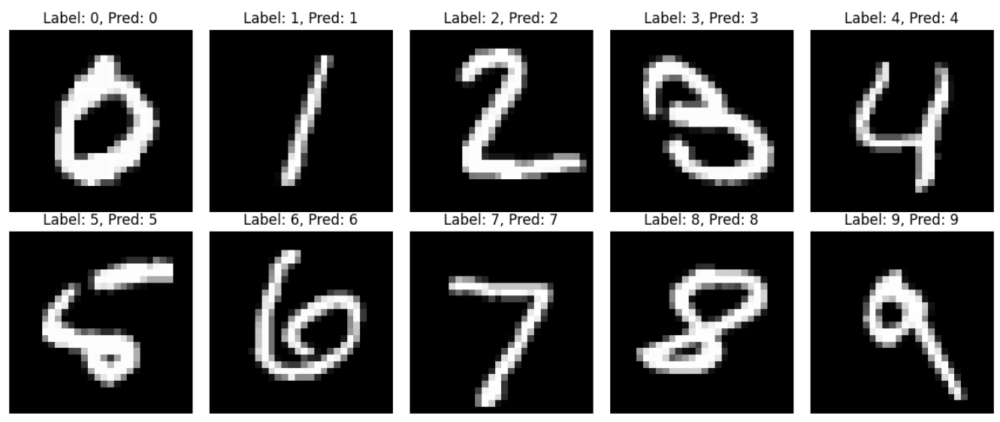

# MNIST Classification with Neural Networks

  

This repository contains two implementations of neural networks for handwritten digit classification on the [MNIST dataset](http://yann.lecun.com/exdb/mnist/) using **PyTorch**.  
The project compares a **fully connected baseline (MLP)** with a **convolutional neural network (CNN)** to highlight the advantages of convolutional architectures for image tasks.

---

## 📊 Results
- **MLP (Multi-Layer Perceptron)**: ~97% test accuracy.  
- **CNN (Convolutional Neural Network)**: ~99% test accuracy.  
- Training and validation curves show significant generalization improvement with CNNs.  

---

## 🚀 Features
- Data preprocessing and normalization using `torchvision`.  
- Two separate implementations: **MLP** (dense layers) and **CNN** (convolutions + pooling).  
- Training pipeline with **Adam optimizer** and **cross-entropy loss**.  
- Evaluation using accuracy and confusion matrices.  
- Modular Jupyter notebooks for interactive exploration.  

---

## 📂 Repository Structure
